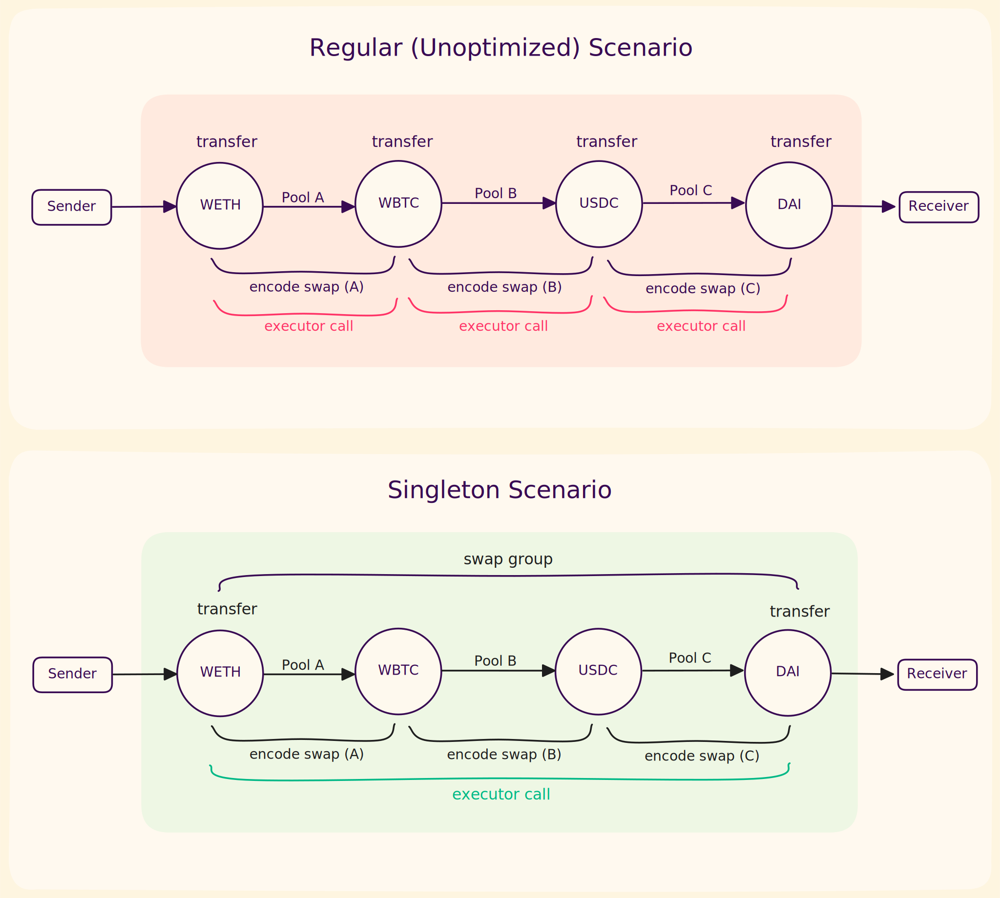

# Encoding

The first step to executing a trade on-chain is encoding.

Our Rust [crate](https://github.com/propeller-heads/tycho-execution/tree/0454514f4f6ccff55dcaa8e3abbb4ac494d89eba/src) converts your trades into calldata
that the Tycho contracts can execute.

See this [Quickstart](../../../#id-4.-encode-a-swap) section for an example of how to encode your trade.

## Models

These are the models used as input and output of the encoding crate.



The `Solution` struct defines your order and how it should be filled. This is the input to the encoding module.

<table><thead><tr><th width="221.11328125" align="center">Attribute</th><th width="218.13671875" align="center">Type</th><th width="264.75">Description</th></tr></thead><tbody><tr><td align="center"><strong>sender</strong></td><td align="center"><code>Bytes</code></td><td>Address of the sender of the token in</td></tr><tr><td align="center"><strong>receiver</strong></td><td align="center"><code>Bytes</code></td><td>Address of the receiver of the token out. If set to the TychoRouter address, these funds will be assigned to the user's <a href="../vault.md#crediting-output-to-the-vault">Vault</a>.</td></tr><tr><td align="center"><strong>token_in</strong></td><td align="center"><code>Bytes</code></td><td>The token being sold</td></tr><tr><td align="center"><strong>amount_in</strong></td><td align="center"><code>BigUint</code></td><td>Amount of the input token</td></tr><tr><td align="center"><strong>token_out</strong></td><td align="center"><code>Bytes</code></td><td>The token being bought.</td></tr><tr><td align="center"><strong>min_amount_out</strong></td><td align="center"><code>BigUint</code></td><td>Minimum amount the receiver must receive at the end of the transaction</td></tr><tr><td align="center"><strong>swaps</strong></td><td align="center"><code>Vec&#x3C;Swap></code></td><td>List of swaps to fulfil the solution.</td></tr><tr><td align="center"><strong>user_transfer_type</strong></td><td align="center"><code>UserTransferType</code></td><td>How user funds are transferred into the router (see below)</td></tr></tbody></table>



Specifies how user funds (the input token) enter the router:

<table><thead><tr><th width="210.01953125" align="center">Variant</th><th>Description</th></tr></thead><tbody><tr><td align="center"><strong>TransferFromPermit2</strong></td><td>Use Permit2 for token transfer. You must approve the Permit2 contract and sign the permit externally.</td></tr><tr><td align="center"><strong>TransferFrom (default)</strong></td><td>Use standard ERC-20 approve + transferFrom. You must approve the TychoRouter to spend your tokens.</td></tr><tr><td align="center"><strong>UseVaultsFunds</strong></td><td>No transfer is performed. Uses tokens already deposited in the TychoRouter vault.</td></tr></tbody></table>



A solution consists of one or more swaps. Each swap represents an operation on a single pool.

The `Swap` struct has the following attributes:

| Attribute                 |              Type              |                                                        Description                                                        |
|---------------------------|:------------------------------:|:-------------------------------------------------------------------------------------------------------------------------:|
| **component**             |      `ProtocolComponent`       |                                            Protocol component from Tycho core                                             |
| **token\_in**             |            `Token`             |                                               Token you provide to the pool                                               |
| **token\_out**            |            `Token`             |                                              Token you expect from the pool                                               |
| **split**                 |             `f64`              |                 Percentage of the amount in to be swapped in this operation (for example, 0.5 means 50%)                  |
| **user\_data**            |        `Option<Bytes>`         |                                        Optional user data to be passed to encoding                                        |
| **protocol\_state**       | `Option<Arc<dyn ProtocolSim>>` |                                     Optional protocol state used to perform the swap                                      |
| **estimated\_amount\_in** |       `Option<BigUint>`        | Optional estimated amount in for this Swap. This is necessary for RFQ protocols. This value is used to request the quote. |

#### Split Swaps

Solutions can split one or more token hops across multiple pools. The output of one swap is divided into parts, each
used as input for subsequent swaps:

<figure><figcaption><p>Diagram representing examples of split swaps</p></figcaption></figure>

By combining splits, you can build complex trade paths.

We validate split swaps. A split swap is valid if:

1. The output token is reachable from the input token through the swap path
2. No tokens are unconnected
3. Each split amount is smaller than 1 (100%) and at least 0 (0%)
4. For each set of splits, set the split for the last swap to 0. This tells the router to send all tokens not assigned
   to the previous splits in the set (i.e., the remainder) to this pool.
5. The sum of all non-remainder splits for each token is smaller than 1 (100%)

<details>

<summary>Example Solution</summary>

The following diagram shows a swap from ETH to DAI through USDC. ETH arrives in the router and is wrapped to WETH. The
solution then splits between three (WETH, USDC) pools and finally swaps from USDC to DAI on one pool.

<figure><figcaption><p>Diagram of an example solution</p></figcaption></figure>

The `Solution` object for the given scenario would look as follows:

<pre class="language-rust"><code class="lang-rust">swap_a = Swap::new(
    pool_a,
    weth_address,
    usdc_address,
    0.3, // 30% of WETH amount
);
swap_b = Swap::new(
    pool_b,
    weth_address,
    usdc_address,
    0.3, // 30% of WETH amount
);
swap_c = Swap::new(
    pool_c,
    weth_address,
    usdc_address,
    0f64, // Rest of remaining WETH amount (40%)
);
swap_d = Swap::new(
    pool_d,
    usdc,
    dai,
    0f64, // All of USDC amount
);

<strong>let solution = Solution::new(
</strong>    user_address.clone(),
    user_address,
    eth_address,       // token_in (ETH — encoder auto-wraps to WETH)
    dai_address,       // token_out
    sell_amount,       // amount_in
    min_amount_out,    // min_amount_out
    vec![swap_a, swap_b, swap_c, swap_d],
);
</code></pre>

</details>

### Swap Group <a href="#swap-group" id="swap-group"></a>

Protocols like Uniswap V4 eliminate token transfers between consecutive swaps through flash accounting. If your solution
contains sequential (non-split) swaps on such protocols, the encoder compresses them into a single **swap group**,
requiring only **one call to the executor**.

<figure><figcaption><p>Diagram representing swap groups</p></figcaption></figure>

In the example above, the encoder will compress three consecutive swaps into the following swap group to call the
Executor:

```rust
SwapGroup {
input_token: weth_address,
output_token: dai_address,
protocol_system: "uniswap_v4",
swaps: vec![weth_wbtc_swap, wbtc_usdc_swap, usdc_dai_swap],
split: 0,
}
```

A solution contains multiple swap groups when it uses different protocols.



Encoding produces an `EncodedSolution` with these attributes:

| Attribute             |          Type          |                                     Description                                      |
|-----------------------|:----------------------:|:------------------------------------------------------------------------------------:|
| **swaps**             |       `Vec<u8>`        |                         The encoded calldata for the swaps.                          |
| **interacting\_with** |        `Bytes`         | The address of the contract to be called (it can be the Tycho Router or an Executor) |
| **selector**          |        `String`        |                      The selector of the function to be called.                      |
| **n\_tokens**         |        `usize`         |          The number of tokens in the trade (relevant for split swaps only).          |
| **permit**            | `Option<PermitSingle>` |            Optional permit object for the trade (if permit2 is enabled).             |
|                       |                        |                                                                                      |




## **Encoder**

**TychoRouterEncoder** prepares calldata for execution via the **Tycho Router** contract. It supports multi-hop and
split swaps.

### Builder

Builder options:

* `swap_encoder_registry` — Registry of protocol-specific `SwapEncoder` s used during encoding.
  Use `add_default_encoders` for built-in support, or add custom encoders for protocols you've implemented locally.
* `router_address` — Router address for execution. Defaults to the deployed address for the given chain (
  see [Tycho addresses](../contract-addresses.md)).

#### **Builder Example Usage**

```rust
let swap_encoder_registry = SwapEncoderRegistry::new(Chain::Ethereum)
.add_default_encoders(None)
.expect("Failed to get default SwapEncoderRegistry");

let encoder = TychoRouterEncoderBuilder::new()
.chain(Chain::Ethereum)
.swap_encoder_registry(swap_encoder_registry)
.build()
.expect("Failed to build encoder");
```

### Swap Encoders

Each protocol needs its own `SwapEncoder` to define how the protocol encodes swaps into calldata.

The `SwapEncoderRegistry` manages these encoders. Call `add_default_encoders()` to use the built-in implementations.
This method accepts an optional `executors_addresses` JSON string with executor addresses for encoding. Pass `None` to
default to `config/executor_addresses.json`.

If you need to add custom protocol support, register your own encoder implementation:

```rust
registry.register_encoder("my_protocol", Box::new(MyCustomEncoder));
```

### Encode

Convert solutions into calldata:

```rust
let encoded_solutions = encoder.encode_solutions(solutions);
```

This returns a `Vec<`[`EncodedSolution`](./#encoded-solution-struct)`>` containing only the encoded swaps. It does **not
** build the full calldata. You must encode the full method call yourself. If you use Permit2, you also need to sign the
permit object.

The full method call includes the following parameters, which act as **execution guardrails:**

* `amountIn` and `tokenIn` — the amount and token to be transferred into the TychoRouter from you.
* `minAmountOut` and `tokenOut` — the minimum amount you want to receive. For maximum security, determine this from a *
  *third-party source**.
* `receiver` — who receives the final output. Set this to the TychoRouter address to credit output tokens to the vault.
* `nTokens` — _(split swaps only)_ the number of distinct tokens in the split routing graph.
* `clientFeeParams` — controls fee-taking and client contribution (see Client Fee Signature below). Pass all-zero values
  if you don't need fees.

The `ClientFeeParams` struct is defined as:

| Field                   | Description                                                                                                                                                                                                                        |
|-------------------------|------------------------------------------------------------------------------------------------------------------------------------------------------------------------------------------------------------------------------------|
| `clientFeeBps`          | Fee percentage in basis points. `100` = 1%. Set to `0` to disable.                                                                                                                                                                 |
| `clientFeeReceiver`     | Address that receives the client's portion of the fee (credited to their vault balance).                                                                                                                                           |
| `maxClientContribution` | Maximum amount the client is willing to pay out of pocket if slippage causes the output to fall below `minAmountOut`. If the shortfall exceeds this value, the transaction reverts. Set to `0` if the client should not subsidize. |
| `deadline`              | Unix timestamp after which the signature is no longer valid.                                                                                                                                                                       |
| `clientSignature`       | EIP-712 signature over all other fields, signed by `clientFeeReceiver`.                                                                                                                                                            |

These **execution guardrails** protect against MEV exploits. Setting them correctly gives you full control over swap
security.

Refer to the [quickstart](../../../) for an example of converting an `EncodedSolution` into full calldata. Tailor the
example to your use case. See the `TychoRouter` contract functions for reference.

**Client Fee Signature**

If you don't want fees, pass all-zero
values: `clientFeeBps: 0`, `clientFeeReceiver: address(0)`, `maxClientContribution: 0`, `deadline: 0`, and an
empty `clientSignature`.

If you do want fees, the `clientFeeReceiver` must sign the fee parameters using EIP-712. This prevents third parties
from spoofing fee configurations. The signature covers the following typed struct:

```solidity
ClientFee(uint16 clientFeeBps,address clientFeeReceiver, uint256 maxClientContribution, uint256 deadline)
```

The EIP-712 domain is:

```solidity
EIP712Domain(string name,string version, uint256 chainId, address verifyingContract)
```

with `name = "TychoRouter"`, `version = "1"`, and `verifyingContract` set to the TychoRouter contract address.

<details>

<summary>Sign fee parameters example</summary>

Example of signing the fee parameters in Rust using `alloy`:

```rust
use alloy::primitives::{keccak256, Address, B256, U256};
use alloy::signers::{local::PrivateKeySigner, SignerSync};
use alloy::sol_types::SolValue;

fn sign_client_fee(
    chain_id: u64,
    router_address: Address,
    client_fee_bps: u16,
    client_fee_receiver: Address,
    max_client_contribution: U256,
    deadline: U256,
    signer: &PrivateKeySigner,
) -> Vec<u8> {
    // Must match CLIENT_FEE_TYPEHASH in TychoRouter.sol
    let type_hash: B256 = keccak256(
        b"ClientFee(uint16 clientFeeBps,address clientFeeReceiver,\
          uint256 maxClientContribution,uint256 deadline)",
    );

    // EIP-712 domain separator
    let domain_type_hash: B256 = keccak256(
        b"EIP712Domain(string name,string version,uint256 chainId,\
          address verifyingContract)",
    );
    let domain_separator: B256 = keccak256(
        (
            domain_type_hash,
            keccak256(b"TychoRouter"),
            keccak256(b"1"),
            U256::from(chain_id),
            router_address,
        )
            .abi_encode(),
    );

    // Struct hash
    let struct_hash: B256 = keccak256(
        (
            type_hash,
            U256::from(client_fee_bps),
            client_fee_receiver,
            max_client_contribution,
            deadline,
        )
            .abi_encode(),
    );

    // EIP-712 digest: keccak256("\x19\x01" ++ domainSeparator ++ structHash)
    let mut data = [0u8; 66];
    data[0] = 0x19;
    data[1] = 0x01;
    data[2..34].copy_from_slice(domain_separator.as_ref());
    data[34..66].copy_from_slice(struct_hash.as_ref());
    let digest: B256 = keccak256(data);

    signer
        .sign_hash_sync(&digest)
        .expect("signing failed")
        .as_bytes()
        .to_vec()
}
```

The returned 65-byte signature is passed as the `clientSignature` field in `ClientFeeParams`.

</details>

## **Run as a Binary**

### Installation

Build and install the binary:

```bash
# Build the project
cargo build --release

# Install the binary to your system
cargo install --path .
```

After installation, you can use the `tycho-encode` command from any directory in your terminal.

### Commands

The command lets you choose the encoder:

* `tycho-router`: Encodes a transaction using the `TychoRouterEncoder`.

The commands accept the same options as the builder (more [here](./#builder-options)).

<details>

<summary><strong>Example</strong></summary>

Encodes a swap from DAI to WETH using Uniswap V2 on Ethereum:

```bash
echo '{
  "sender": "0x1234567890123456789012345678901234567890",
  "receiver": "0x1234567890123456789012345678901234567890",
  "token_in": "0x6B175474E89094C44Da98b954EedeAC495271d0F",
  "amount_in": "1000000000000000000",
  "token_out": "0xC02aaA39b223FE8D0A0e5C4F27eAD9083C756Cc2",
  "exact_out": false,
  "min_amount_out": "1",
  "max_client_contribution": "0",
  "user_transfer_type": "TransferFrom",
  "swaps": [
    {
      "component": {
        "id": "0xA478c2975Ab1Ea89e8196811F51A7B7Ade33eB11",
        "protocol_system": "uniswap_v2",
        "protocol_type_name": "uniswap_v2_pool",
        "chain": "ethereum",
        "tokens": [
          "0xC02aaA39b223FE8D0A0e5C4F27eAD9083C756Cc2",
          "0x6B175474E89094C44Da98b954EedeAC495271d0F"
        ],
        "contract_addresses": [],
        "static_attributes": {
          "factory": "0x5c69bee701ef814a2b6a3edd4b1652cb9cc5aa6f"
        },
        "change": "Update",
        "creation_tx": "0x0000000000000000000000000000000000000000000000000000000000000000",
        "created_at": "2024-01-01T00:00:00"
      },
      "token_in": {
        "address": "0x6B175474E89094C44Da98b954EedeAC495271d0F",
        "symbol": "DAI",
        "decimals": 18,
        "tax": 0,
        "gas": [],
        "chain": "ethereum",
        "quality": 100
      },
      "token_out": {
        "address": "0xC02aaA39b223FE8D0A0e5C4F27eAD9083C756Cc2",
        "symbol": "WETH",
        "decimals": 18,
        "tax": 0,
        "gas": [],
        "chain": "ethereum",
        "quality": 100
      },
      "split": 0.0
    }
  ]
}' | tycho-encode --chain ethereum tycho-router
```

</details>
