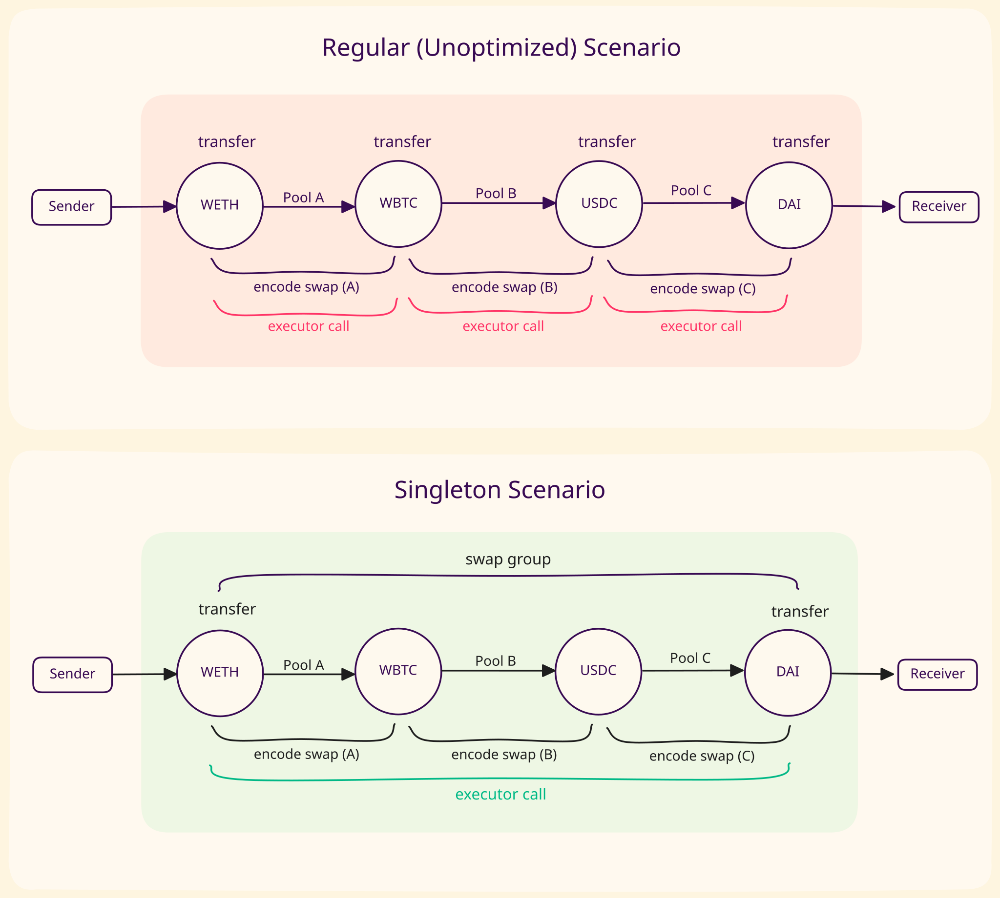

# Encoding

The first step to executing a trade on-chain is encoding.

Our Rust <a href="https://github.com/propeller-heads/tycho-indexer/tree/main/crates/tycho-execution/src" target="_blank" rel="noopener noreferrer">crate</a>
converts your trades into calldata
that the Tycho contracts can execute.

See this [Quickstart](../../../#id-4.-encode-a-swap) section for an example of how to encode your trade.

## Models

These are the models used as input and output of the encoding crate.



The `Solution` struct defines your order and how it should be filled. This is the input to the encoding module.

<table>
<thead><tr><th width="210" align="center">Attribute</th><th width="210" align="center">Type</th><th width="280">Description</th></tr></thead>
<tbody>
<tr><td align="center"><strong>sender</strong></td><td align="center"><code>Bytes</code></td><td>Address of the sender of the token in</td></tr>
<tr><td align="center"><strong>receiver</strong></td><td align="center"><code>Bytes</code></td><td>Address that receives the output token. If set to the TychoRouterV3 address, the output is credited to the <strong>sender's</strong> <a href="../vault.md#crediting-output-to-the-vault">vault balance</a> instead of being transferred out.</td></tr>
<tr><td align="center"><strong>token_in</strong></td><td align="center"><code>Bytes</code></td><td>The input token</td></tr>
<tr><td align="center"><strong>amount_in</strong></td><td align="center"><code>BigUint</code></td><td>Amount of the input token</td></tr>
<tr><td align="center"><strong>token_out</strong></td><td align="center"><code>Bytes</code></td><td>The output token</td></tr>
<tr><td align="center"><strong>expected_amount_out</strong></td><td align="center"><code>BigUint</code></td><td>The output amount your simulation quoted. The router receives it as <code>expectedAmountOut</code>. Encoding fails if it is zero</td></tr>
<tr><td align="center"><strong>min_amount_out</strong></td><td align="center"><code>BigUint</code></td><td>The smallest output you accept. The router receives it as <code>minAmountOut</code> and reverts below it. Compute it off-chain from your slippage tolerance, e.g. <code>expected_amount_out * 0.9975</code> for 0.25%</td></tr>
<tr><td align="center"><strong>swaps</strong></td><td align="center"><code>Vec&#x3C;Swap></code></td><td>List of swaps to fulfil the solution</td></tr>
<tr><td align="center"><strong>user_transfer_type</strong></td><td align="center"><code>UserTransferType</code></td><td>How the input token enters the router — see the <strong>UserTransferType</strong> tab</td></tr>
<tr><td align="center"><strong>quote_request_id</strong></td><td align="center"><code>Option&#x3C;String></code></td><td>Identifier of the quote request the solution answers. The encoder attributes RFQ quotes (e.g. Hashflow) to an address derived from the sender and this id, so concurrent quote requests get independent nonce sequences. When unset, the encoder attributes quotes to the sender</td></tr>
</tbody>
</table>

#### Output amounts <a href="#output-amounts" id="output-amounts"></a>

The router takes two output guardrails, and the solution supplies both:

<table>
<thead><tr><th width="300">Solution</th><th width="240">Router argument</th></tr></thead>
<tbody>
<tr><td><code>expected_amount_out()</code></td><td><code>expectedAmountOut</code></td></tr>
<tr><td><code>min_amount_out()</code></td><td><code>minAmountOut</code></td></tr>
</tbody>
</table>

Both are absolute amounts, so refreshing a quote means updating both — apply your slippage
tolerance to the new quote and set `min_amount_out` to the result. The router caps `minAmountOut`
at `expectedAmountOut` (see [Slippage bounds](#slippage-bounds)), so it rejects a floor above the
quote.



Specifies how user funds (the input token) enter the router:

<table><thead><tr><th width="210.01953125" align="center">Variant</th><th>Description</th></tr></thead><tbody><tr><td align="center"><strong>TransferFromPermit2</strong></td><td>Use Permit2 for token transfer. You must approve the Permit2 contract and sign the permit externally.</td></tr><tr><td align="center"><strong>TransferFrom</strong> <em>(default)</em></td><td>Use standard ERC-20 approve + transferFrom. You must approve the TychoRouterV3 to spend your tokens.</td></tr><tr><td align="center"><strong>UseVaultsFunds</strong></td><td>No transfer is performed. Uses tokens already deposited in the TychoRouterV3 vault.</td></tr></tbody></table>



A solution consists of one or more swaps. Each swap represents an operation on a single pool.

The `Swap` struct has the following attributes:

<table><thead><tr><th width="210" align="center">Attribute</th><th width="210" align="center">Type</th><th width="280">Description</th></tr></thead><tbody><tr><td align="center"><strong>component</strong></td><td align="center"><code>ProtocolComponent</code></td><td>Protocol component from <code>tycho-common</code></td></tr><tr><td align="center"><strong>token_in</strong></td><td align="center"><code>Token</code></td><td>The token you provide to the pool</td></tr><tr><td align="center"><strong>token_out</strong></td><td align="center"><code>Token</code></td><td>The token you expect from the pool</td></tr><tr><td align="center"><strong>split</strong></td><td align="center"><code>f64</code></td><td>Fraction of the input amount to route through this swap, as a decimal between 0 and 1 (e.g. <code>0.5</code> = 50%)</td></tr><tr><td align="center"><strong>user_data</strong></td><td align="center"><code>Option&#x3C;Bytes></code></td><td>Optional user data to be passed to encoding</td></tr><tr><td align="center"><strong>protocol_state</strong></td><td align="center"><code>Option&#x3C;Arc&#x3C;dyn ProtocolSim>></code></td><td>Optional protocol state used to perform the swap</td></tr><tr><td align="center"><strong>estimated_amount_in</strong></td><td align="center"><code>Option&#x3C;BigUint></code></td><td>Optional estimated amount in for this swap. Necessary for RFQ protocols — used to request the quote.</td></tr><tr><td align="center"><strong>estimated_gas</strong></td><td align="center"><code>BigUint</code></td><td>Per-swap gas estimate from simulation</td></tr></tbody></table>

#### Split Swaps

Solutions can split one or more token hops across multiple pools. The output of one swap is divided into parts, each
used as input for subsequent swaps:

<figure><figcaption><p>Diagram representing examples of split swaps</p></figcaption></figure>

By combining splits, you can build complex trade paths.

We validate split swaps. A split swap is valid if:

1. The output token is reachable from the input token through the swap path
2. No tokens are unconnected
3. Each split amount is smaller than 1 (100%) and at least 0 (0%)
4. For each set of splits, set the split for the last swap to 0. This tells the router to send all tokens not assigned
   to the previous splits in the set (i.e., the remainder) to this pool.
5. The sum of all non-remainder splits for each token is smaller than 1 (100%)


**Split fractions are applied to the balance seen so far.** The router processes swaps
sequentially. A non-zero `split` takes a fraction of the total amount produced for that token
*up to that point in the swap array* — not the final total. A `split` of 0 consumes whatever
remains. If more of the same token is produced by a later swap, it will not be included in
any earlier split's calculation.


<details>

<summary>Example Solution</summary>

The following diagram shows a swap from ETH to DAI through USDC. The first swap wraps ETH to WETH on the
`native_wrapper` component. The solution then splits between three (WETH, USDC) pools and finally swaps from USDC to DAI
on one pool.

<figure><figcaption><p>Diagram of an example solution</p></figcaption></figure>

The `Solution` object for the given scenario would look as follows:

<pre class="language-rust"><code class="lang-rust">swap_wrap = Swap::new(native_wrapper, eth_token, weth_token.clone(), gas_wrap);
    // split defaults to 0 — wraps the full ETH amount
swap_a = Swap::new(pool_a, weth_token.clone(), usdc_token.clone(), gas_a)
    .with_split(0.3); // 30% of WETH amount
swap_b = Swap::new(pool_b, weth_token.clone(), usdc_token.clone(), gas_b)
    .with_split(0.3); // 30% of WETH amount
swap_c = Swap::new(pool_c, weth_token.clone(), usdc_token.clone(), gas_c);
    // split defaults to 0 — pool receives the remaining 40%
swap_d = Swap::new(pool_d, usdc_token, dai_token, gas_d);
    // split defaults to 0 — pool receives all USDC

<strong>let solution = Solution::new(
</strong>    user_address.clone(),
    user_address,
    eth_address,       // token_in
    dai_address,       // token_out
    sell_amount,       // amount_in
    amount_out,        // quoted output, becomes expectedAmountOut
    min_amount_out,    // 0.25% below the quote, becomes minAmountOut
    vec![swap_wrap, swap_a, swap_b, swap_c, swap_d],
);
</code></pre>

The 4th argument to `Swap::new` is the per-swap `estimated_gas` (a `BigUint`). Splits are configured
via `.with_split(...)` on the builder.

</details>

### Swap Group <a href="#swap-group" id="swap-group"></a>

Protocols like Uniswap V4 eliminate token transfers between consecutive swaps through flash accounting. If your solution
contains sequential (non-split) swaps on such protocols, the encoder compresses them into a single **swap group**,
requiring only **one call to the executor**.

<figure><figcaption><p>Diagram representing swap groups</p></figcaption></figure>

In the example above, the encoder will compress three consecutive swaps into the following swap group to call the
Executor:

```rust
SwapGroup {
input_token: weth_address,
output_token: dai_address,
protocol_system: "uniswap_v4",
swaps: vec![weth_wbtc_swap, wbtc_usdc_swap, usdc_dai_swap],
split: 0,
}
```

A solution contains multiple swap groups when it uses different protocols.



Encoding produces an `EncodedSolution` with these attributes:

<table>
<thead><tr><th width="210" align="center">Attribute</th><th width="210" align="center">Type</th><th width="280">Description</th></tr></thead>
<tbody>
<tr><td align="center"><strong>swaps</strong></td><td align="center"><code>Vec&#x3C;u8></code></td><td>The encoded calldata for the swaps</td></tr>
<tr><td align="center"><strong>interacting_with</strong></td><td align="center"><code>Bytes</code></td><td>The address of the contract to be called (e.g. the Tycho Router or an Executor)</td></tr>
<tr><td align="center"><strong>function_signature</strong></td><td align="center"><code>String</code></td><td>Full signature of the router method to call, e.g. <code>splitSwapUsingVault(uint256,address,...)</code>. It reflects both the swap strategy and the funding mode</td></tr>
<tr><td align="center"><strong>n_tokens</strong></td><td align="center"><code>usize</code></td><td>The number of tokens in the trade (relevant for split swaps only)</td></tr>
<tr><td align="center"><strong>estimated_gas</strong></td><td align="center"><code>BigUint</code></td><td>Estimated gas usage for the encoded solution</td></tr>
</tbody>
</table>




## **Encoder**

**TychoRouterEncoder** prepares calldata for execution via the **Tycho Router** contract. It supports multi-hop and
split swaps.

### Builder

Builder options:

* `swap_encoder_registry` — Registry of protocol-specific `SwapEncoder`s used during encoding.
  Use `new_with_defaults` for built-in support, or add custom encoders for protocols you've implemented locally.
* `router_address` — Router address for execution. Defaults to the deployed address for the given chain (
  see [Tycho addresses](../contract-addresses.md)).

#### **Builder Example Usage**

```rust
let swap_encoder_registry = SwapEncoderRegistry::new_with_defaults(Chain::Ethereum)
.expect("Failed to get default SwapEncoderRegistry");

let encoder = TychoRouterEncoderBuilder::new()
.chain(Chain::Ethereum)
.swap_encoder_registry(swap_encoder_registry)
.build()
.expect("Failed to build encoder");
```

### Swap Encoders

Each protocol needs its own `SwapEncoder` to define how the protocol encodes swaps into calldata.

The `SwapEncoderRegistry` manages these encoders. Use `SwapEncoderRegistry::new_with_defaults(chain)` to get a registry pre-populated with all built-in encoders. If you need to supply custom executor addresses, use `SwapEncoderRegistry::new(chain).add_default_encoders(Some(addresses_json))` instead.

If you need to add custom protocol support, register your own encoder implementation:

```rust
registry.register_encoder("my_protocol", Box::new(MyCustomEncoder));
```

### Encode

Convert solutions into calldata:

```rust
let encoded_solutions = encoder.encode_solutions(solutions);
```

This returns a `Vec<EncodedSolution>` containing only the encoded swaps. It does **not** build the full calldata. You must encode the full method call yourself. If you use Permit2, you must handle permit
creation and signing yourself using the public `Permit2` utility (see [Token transfers](../#permit2)).

The full method call includes the following parameters, which act as **execution guardrails:**

* `amountIn` and `tokenIn` — the amount and token you transfer into the TychoRouterV3. For native ETH, use `0xEeeeeEeeeEeEeeEeEeEeeEEEeeeeEeeeeeeeEEeE`. The router reverts if the token is `address(0)` or the amount is zero.
* `expectedAmountOut` — your quoted output amount, taken from `solution.expected_amount_out()`. The router measures positive slippage against it and caps `minAmountOut` at it (see [Slippage bounds](#slippage-bounds)). It must be greater than zero.
* `minAmountOut` and `tokenOut` — the smallest output you are willing to accept once fees are deducted, taken from `solution.min_amount_out()`. The same native ETH address rule applies. For maximum security, derive the underlying quote from a **third-party source**.
* `receiver` — who receives the final output. Set this to the TychoRouterV3 address to credit output tokens to the vault.
* `nTokens` — _(split swaps only)_ the number of distinct tokens in the split routing graph.
* `clientFeeParams` — controls fee-taking and client contribution (see [Client Fee Signature](#client-fee-signature)). Pass all-zero values if you don't need fees.

The `ClientFeeParams` struct is defined as:

<table>
<thead><tr><th width="210">Field</th><th width="490">Description</th></tr></thead>
<tbody>
<tr><td><code>clientFeeBps</code></td><td>Client fee as a <code>uint32</code> in fee units, where <code>100_000_000</code> = 100% (see <a href="#fee-units">Fee units</a>). Set to <code>0</code> to take no fee</td></tr>
<tr><td><code>clientFeeReceiver</code></td><td>Address that receives the client fee (credited to their vault balance)</td></tr>
<tr><td><code>maxClientContribution</code></td><td>Maximum amount the client is willing to pay out of pocket if slippage causes the output to fall below <code>minAmountOut</code>. If the shortfall exceeds this value, the transaction reverts. Set to <code>0</code> if the client should not subsidize</td></tr>
<tr><td><code>deadline</code></td><td>Unix timestamp after which the signature is no longer valid</td></tr>
<tr><td><code>clientSignature</code></td><td>EIP-712 signature over the fee fields <strong>and</strong> the full swap intent, signed by <code>clientFeeReceiver</code>: a 65-byte ECDSA signature when that address is an EOA, or an ERC-1271 signature of any length when it is a contract</td></tr>
</tbody>
</table>

#### Fee units <a href="#fee-units" id="fee-units"></a>

`clientFeeBps` and the router's own fee rates use an 8-decimal fee unit rather than plain basis
points, which lets the router charge sub-BPS rates:

| Rate | Fee units |
|------|-----------|
| 100% | `100_000_000` |
| 1% | `1_000_000` |
| 1 BPS (0.01%) | `10_000` |
| 0.1 BPS (0.001%) | `1_000` |

The FeeCalculator exposes both values: `MAX_BPS` (`100_000_000`) and `MAX_BPS_SQUARED` (`MAX_BPS²`,
the combined denominator when the router charges a fee on another fee).

The `tycho-execution` crate provides a `ClientFeeParams` Rust struct that mirrors this. Callers are responsible for
constructing and signing it — the encoder does not use it internally. Call `.into_abi_params()` to convert it to the
ABI-encodable tuple for calldata construction.

```rust
// No fee
let params = ClientFeeParams::default().into_abi_params();

// With a 1 BPS fee (10_000 fee units)
let params = ClientFeeParams::new(receiver, signature, deadline, 10_000u32)
    .with_max_client_contribution(max_contribution)
    .into_abi_params();
```

These **execution guardrails** protect against MEV exploits. Setting them correctly gives you full control over swap
security.

Refer to the [quickstart](../../../) for an example of converting an `EncodedSolution` into full calldata. Tailor the
example to your use case. See the `TychoRouterV3` contract functions for reference.

#### Slippage bounds <a href="#slippage-bounds" id="slippage-bounds"></a>

`minAmountOut` must be non-zero and no greater than `expectedAmountOut`:

```
0  <  minAmountOut  <=  expectedAmountOut
```

The router reverts with `TychoRouter__InvalidMinAmountOut` for a zero `minAmountOut` or one above
`expectedAmountOut`. There is no lower cap on how far below the quote you may set it, so compute a
real floor from your slippage tolerance — a `minAmountOut` set too low exposes the swap to MEV
attacks. Pass the amount your simulation returned as `expectedAmountOut`.


The router may capture output above `expectedAmountOut` as positive slippage, so it does not guarantee
that surplus beyond your quote reaches the receiver. Amounts between `minAmountOut` and
`expectedAmountOut` always do.


#### Native Tokens <a href="#native-tokens" id="native-tokens"></a>

ETH and WETH are separate tokens in a solution, and the encoder does not convert between them for you.
Wherever your route goes from one to the other, add a swap on the `native_wrapper` protocol. The Tycho
stream injects a `native_wrapper` component on every chain, so you route through it like through any
other pool, and a dedicated WETH executor runs the swap.

Your swaps must connect `token_in` to `token_out`, so a missing wrap swap is rejected at validation.

#### Client Fee Signature <a href="#client-fee-signature" id="client-fee-signature"></a>

Only required when charging a fee or allowing a client contribution. The `clientFeeReceiver` must sign
using EIP-712 — this prevents third parties from spoofing fee configurations. The signature covers the
fee parameters **and** the full swap intent:

```solidity
ClientFee(uint32 clientFeeBps, address clientFeeReceiver, uint256 maxClientContribution,
          uint256 deadline, uint256 amountIn, address tokenIn, address tokenOut,
          uint256 expectedAmountOut, uint256 minAmountOut, address receiver, bytes swaps)
```

`swaps` is the encoded swap graph — the same bytes you pass to the router. EIP-712 requires dynamic
types to be hashed, so pass `keccak256(swaps)` when you build the struct hash.

The signature covers every field above, which means it only validates for a swap with identical input
parameters. Re-encoding the route or changing any amount invalidates it, so sign after you encode
rather than before.

To confirm you are signing the right struct, compare your typehash against the router's public
`CLIENT_FEE_TYPEHASH` constant.

The EIP-712 domain is:

```solidity
EIP712Domain(string name, string version, uint256 chainId, address verifyingContract)
```

with `name = "TychoRouter"`, `version = "1"`, and `verifyingContract` set to the TychoRouterV3 contract address.

The `clientFeeReceiver` can be an EOA or a contract. The router first recovers the signature with ECDSA and accepts it
when it recovers to `clientFeeReceiver`. Otherwise it staticcalls
`isValidSignature(digest, clientSignature)` on the receiver and accepts the fee when that call returns the
<a href="https://eips.ethereum.org/EIPS/eip-1271" target="_blank" rel="noopener noreferrer">ERC-1271</a> magic value.
A contract receiver therefore decides for itself what counts as a valid signature — a Safe, for example, checks owner
signatures — and `clientSignature` carries no length constraint in that case. ECDSA runs first, so an EOA that carries
delegated code (EIP-7702) keeps signing with its own key.


**Contract signatures are revocable.** A `clientSignature` that a contract accepts in one block may fail in the next if
the contract's validation state changes, for example after an owner rotation.



**Replay attack risk.** The signature contains no nonce. Once a signed `ClientFeeParams` appears on-chain, anyone who sees it can reuse it for a swap with identical input parameters — same `amountIn`, tokens, `expectedAmountOut`, `minAmountOut`, `receiver`, and encoded route — until `deadline` expires. If `maxClientContribution > 0`, the swap's `receiver` can repeatedly replay the transaction — each replay debits the client's vault balance by up to `maxClientContribution` — until the balance is exhausted or the deadline passes.

To minimise exposure:
* Set `deadline` as close to the current block timestamp as practical (e.g., a few minutes ahead).
* Set `maxClientContribution` as low as the intended use case allows.


<details>

<summary>Sign fee parameters example</summary>

Example of signing the fee parameters in Rust using `alloy`:

```rust
use alloy::primitives::{keccak256, Address, B256, U256};
use alloy::signers::{local::PrivateKeySigner, SignerSync};
use alloy::sol_types::SolValue;

/// Swap parameters the signature is bound to. These must be byte-identical to
/// the arguments you pass to the router method.
struct SwapIntent {
    amount_in: U256,
    token_in: Address,
    token_out: Address,
    expected_amount_out: U256,
    min_amount_out: U256,
    receiver: Address,
    /// The encoded swap graph — `encoded_solution.swaps()`
    swaps: Vec<u8>,
}

fn sign_client_fee(
    chain_id: u64,
    router_address: Address,
    client_fee_bps: u32,
    client_fee_receiver: Address,
    max_client_contribution: U256,
    deadline: U256,
    intent: &SwapIntent,
    signer: &PrivateKeySigner,
) -> Vec<u8> {
    // Must match CLIENT_FEE_TYPEHASH in TychoRouterV3.sol
    let type_hash: B256 = keccak256(
        b"ClientFee(uint32 clientFeeBps,address clientFeeReceiver,\
          uint256 maxClientContribution,uint256 deadline,\
          uint256 amountIn,address tokenIn,address tokenOut,\
          uint256 expectedAmountOut,uint256 minAmountOut,address receiver,bytes swaps)",
    );

    // EIP-712 domain separator
    let domain_type_hash: B256 = keccak256(
        b"EIP712Domain(string name,string version,uint256 chainId,\
          address verifyingContract)",
    );
    let domain_separator: B256 = keccak256(
        (
            domain_type_hash,
            keccak256(b"TychoRouter"),
            keccak256(b"1"),
            U256::from(chain_id),
            router_address,
        )
            .abi_encode(),
    );

    // Struct hash — dynamic `bytes swaps` is hashed, per EIP-712
    let struct_hash: B256 = keccak256(
        (
            type_hash,
            U256::from(client_fee_bps),
            client_fee_receiver,
            max_client_contribution,
            deadline,
            intent.amount_in,
            intent.token_in,
            intent.token_out,
            intent.expected_amount_out,
            intent.min_amount_out,
            intent.receiver,
            keccak256(&intent.swaps),
        )
            .abi_encode(),
    );

    // EIP-712 digest: keccak256("\x19\x01" ++ domainSeparator ++ structHash)
    let mut data = [0u8; 66];
    data[0] = 0x19;
    data[1] = 0x01;
    data[2..34].copy_from_slice(domain_separator.as_ref());
    data[34..66].copy_from_slice(struct_hash.as_ref());
    let digest: B256 = keccak256(data);

    signer
        .sign_hash_sync(&digest)
        .expect("signing failed")
        .as_bytes()
        .to_vec()
}
```

Pass the returned 65-byte signature as the `clientSignature` field in `ClientFeeParams`. A contract receiver supplies
its own ERC-1271 signature instead, of any length.

</details>

## Run as a Binary

The encoding crate ships a `tycho-encode` CLI that lets you encode swaps without writing Rust. Install it with:

```bash
cargo install --path crates/tycho-execution
tycho-encode --version  # verify the install succeeded
```

Pass a JSON-serialised `Solution` via stdin and specify the encoder as a subcommand:

* `tycho-router` — encodes using `TychoRouterEncoder`

The CLI accepts the same options as the [builder](#builder).

<details>

<summary><strong>Example</strong></summary>

Encodes a swap from DAI to WETH using Uniswap V2 on Ethereum:

```bash
echo '{
  "sender": "0x1234567890123456789012345678901234567890",
  "receiver": "0x1234567890123456789012345678901234567890",
  "token_in": "0x6B175474E89094C44Da98b954EedeAC495271d0F",
  "amount_in": "1000000000000000000",
  "token_out": "0xC02aaA39b223FE8D0A0e5C4F27eAD9083C756Cc2",
  "expected_amount_out": "380000000000000",
  "min_amount_out": "379050000000000",
  "user_transfer_type": "TransferFrom",
  "swaps": [
    {
      "component": {
        "id": "0xA478c2975Ab1Ea89e8196811F51A7B7Ade33eB11",
        "protocol_system": "uniswap_v2",
        "protocol_type_name": "uniswap_v2_pool",
        "chain": "ethereum",
        "tokens": [
          "0xC02aaA39b223FE8D0A0e5C4F27eAD9083C756Cc2",
          "0x6B175474E89094C44Da98b954EedeAC495271d0F"
        ],
        "contract_addresses": [],
        "static_attributes": {
          "factory": "0x5c69bee701ef814a2b6a3edd4b1652cb9cc5aa6f"
        },
        "change": "Update",
        "creation_tx": "0x0000000000000000000000000000000000000000000000000000000000000000",
        "created_at": "2024-01-01T00:00:00"
      },
      "token_in": {
        "address": "0x6B175474E89094C44Da98b954EedeAC495271d0F",
        "symbol": "DAI",
        "decimals": 18,
        "tax": 0,
        "gas": [60000],
        "chain": "ethereum",
        "quality": 100
      },
      "token_out": {
        "address": "0xC02aaA39b223FE8D0A0e5C4F27eAD9083C756Cc2",
        "symbol": "WETH",
        "decimals": 18,
        "tax": 0,
        "gas": [60000],
        "chain": "ethereum",
        "quality": 100
      },
      "split": 0.0,
      "estimated_gas": [120000]
    }
  ]
}' | tycho-encode --chain ethereum tycho-router
```

</details>
