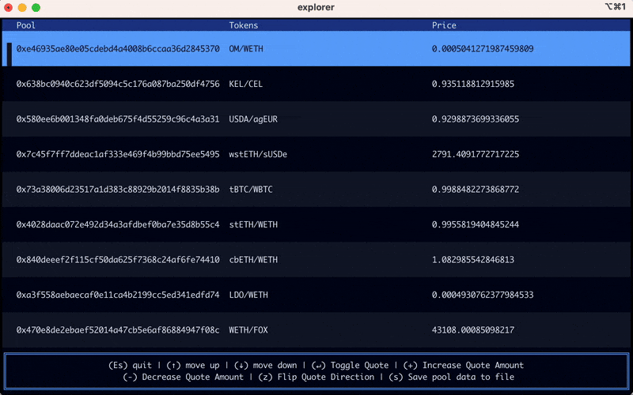

# Simulation

<figure><figcaption></figcaption></figure>

Tycho Simulation is a Rust crate that provides powerful tools for **interacting with protocol states**, **calculating spot prices**, and **simulating token swaps**.

The repository is available [here](https://github.com/propeller-heads/tycho-simulation).

## Installation

The `tycho-simulation` package is available on [Github](https://github.com/propeller-heads/tycho-simulation).

To use the simulation tools with Ethereum Virtual Machine (EVM) chains, add the optional `evm` feature flag to your dependency configuration:

```toml
tycho-simulation = { 
     git = "https://github.com/propeller-heads/tycho-simulation.git",
     package = "tycho-simulation",
     tag = "x.y.z", # Replace with latest version
     features = ["evm"]
}

```

Add this to your project's `Cargo.toml` file.


**Note:** Replace `x.y.z` with the latest version number from our [GitHub Releases page](https://github.com/propeller-heads/tycho-simulation/releases). Using the latest release ensures you have the most up-to-date features and bug fixes.


## Main Interface

All protocols implement the `ProtocolSim` trait (see definition [here](https://github.com/propeller-heads/tycho-simulation/blob/e588151d25a6d8070f7813b4ea8608329d221ab2/src/protocol/state.rs#L66)). It has the main methods:

#### Spot price

`spot_price` returns the pool's current marginal price.

```rust
fn spot_price(&self, base: &Token, quote: &Token) -> Result<f64, SimulationError>;
```

#### Get amount out

`get_amount_out` simulates token swaps.

```rust
fn get_amount_out(
    &self,
    amount_in: BigUint,
    token_in: &Token,
    token_out: &Token,
) -> Result<GetAmountOutResult, SimulationError>;
```

You receive a `GetAmountOutResult` , which is defined as follows:

```rust
pub struct GetAmountOutResult {
    pub amount: BigUint, // token_out amount you receive
    pub gas: BigUint, // gas cost
    pub new_state: Box<dyn ProtocolSim>, // state of the protocol after the swap
}
```

`new state` allows you to, for example, simulate consecutive swaps in the same protocol.

Please refer to the [in-code documentation](../../tycho-common/src/simulation/protocol_sim.rs#L116) of the `ProtocolSim` trait and its methods for more in-depth information.

#### Fee

`fee` returns the fee of the protocol as a ratio.\
For example if the fee is 1%, the value returned would be 0.01.


If the fee is dynamic, it returns the minimal fee.


```rust
fn fee(&self) -> f64;
```

#### Get limits

`get_limits` returns a tuple containing the maximum amount in and out that can be traded between two tokens.


If there are no hard limits to the swap (for example for Uniswap V2), the returned amount will be a "soft" limit, meaning that the actual amount traded could be higher but it's advised to not exceed it.


```rust
fn get_limits(
        &self,
        sell_token: Address,
        buy_token: Address,
    ) -> Result<(BigUint, BigUint), SimulationError>;
```

#### Swap to price

`swap_to_price` returns the amount of `token_in` required to move the pool's marginal price down to a target price, and the amount of `token_out` received.\
The `target_price` is denoted as `token_out` (numerator) per `token_in` (denominator) net of all fees.

```rust
fn swap_to_price(
        &self,
        token_in: Address,
        token_out: Address,
        target_price: Price,
    ) -> Result<Trade, SimulationError>
```

`Price` represents a price as a rational fraction (numerator / denominator).

```rust
pub struct Price {
    pub numerator: BigUint,
    pub denominator: BigUint,
}
```

`Trade` represents a trade between two tokens at a given price on a pool.

```rust
pub struct Trade {
    pub amount_in: BigUint,
    pub amount_out: BigUint,
}
```

#### Query supply

`query_supply` returns the maximum amount of `token_out` a pool can supply, and corresponding `token_in` demand, while respecting a minimum trade price.\
The `target_price` is denoted as `token_out` (numerator) per `token_in` (denominator) net of all fees.

<pre class="language-rust"><code class="lang-rust">fn query_supply(
        &#x26;self,
        token_in: Address,
        token_out: Address,
        target_price: Price,
<strong>    ) -> Result&#x3C;Trade, SimulationError>
</strong></code></pre>

Please refer to the [in-code documentation](../../tycho-common/src/simulation/protocol_sim.rs#L236) of the `ProtocolSim` trait and its methods for more in-depth information.

## Streaming Protocol States

To maintain up-to-date states of the protocols you wish to simulate over, you can use a Tycho Indexer stream. Such a stream can be set up in 2 easy steps:

#### Step 1: Fetch tokens

It is necessary to collect all tokens you are willing to support/swap over as this must be set on the stream builder in step 2. You can either set up custom logic to define this, or use the Tycho Indexer RPC to fetch and filter for tokens of interest. To simplify this, a util function called `load_all_tokens`is supplied and can be used as follows:

```rust
use tycho_simulation::utils::load_all_tokens;
use tycho_core::models::Chain;

let all_tokens = load_all_tokens(
            "tycho-beta.propellerheads.xyz",  // tycho url
            false,                            // use tsl (this flag disables tsl)
            Some("sampletoken"),              // auth key
            Chain::Ethereum,                  // chain
            None,                             // min quality (defaults to 100: ERC20-like tokens only) 
            None,                             // days since last trade (has chain specific defaults)
        ).await;
```

#### Step 2: Create a stream

You can use the [ProtocolStreamBuilder](https://github.com/propeller-heads/tycho-simulation/blob/main/src/evm/stream.rs#L55) to easily set up and manage multiple protocols within one stream. An example of creating such a stream with Uniswap V2 and Balancer V2 protocols is as follows:

```rust
use tycho_simulation::evm::{
    engine_db::tycho_db::PreCachedDB,
    protocol::{
        filters::balancer_pool_filter, uniswap_v2::state::UniswapV2State, vm::state::EVMPoolState,
    },
    stream::ProtocolStreamBuilder,
};
use tycho_core::models::Chain;
use tycho_client::feed::component_tracker::ComponentFilter;

let tvl_filter = ComponentFilter::with_tvl_range(9, 10); // filter buffer of 9-10ETH
let mut protocol_stream = ProtocolStreamBuilder::new("tycho-beta.propellerheads.xyz", Chain::Ethereum)
    .exchange::<UniswapV2State>("uniswap_v2", tvl_filter.clone(), None)
    .exchange::<EVMPoolState<PreCachedDB>>(
        "vm:balancer_v2",
        tvl_filter.clone(),
        Some(balancer_pool_filter),
    )
    .auth_key(Some("sampletoken"))
    .skip_state_decode_failures(true) // skips the pool instead of panicking if it errors on decode
    .set_tokens(all_tokens.clone())
    .await
    .build()
    .await
    .expect("Failed building protocol stream");
```

Some protocols, such as Balancer V2 and Curve, require a pool filter to be defined to filter out unsupported pools. If a protocol needs a pool filter and the user does not provide one, a warning will be raised during the stream setup process.

The stream created emits `Update` messages which consist of:

* `block number_or_timestamp`- the block this update message refers to
* `new_pairs`- new components witnessed (either recently created or newly meeting filter criteria)
* `removed_pairs`- components no longer tracked (either deleted due to a reorg or no longer meeting filter criteria)
* `states`- the updated `ProtocolSim` states for all components modified in this block

The first message received will contain states for all protocol components registered to. Thereafter, further block updates will only contain data for updated or new components.

> Note: For efficiency, `ProtocolSim` states contain simulation-critical data only. Reference data such as protocol names and token information is provided in the `ProtocolComponent` objects within the `new_pairs` field. Consider maintaining a store of these components if you need this metadata.

For a full list of supported protocols and the simulation state implementations they use, see [Supported Protocols](supported-protocols.md).

<details>

<summary>Example: Consuming the Stream and Simulating</summary>

This simplified example shows how to process the stream created above and run simulations on the updated pools. Since the first message of the stream contains all pools, this means the first iteration of the loop will simulate on everything.

In this example we choose 2 tokens: a buy and a sell token, and simulate only on pools that contain those tokens.

<pre class="language-rust"><code class="lang-rust"> // SIMULATION PARAMS
 // Set sell and buy tokens to USDC and USDT respectively
 let sell_token = Token::new("0xa0b86991c6218b36c1d19d4a2e9eb0ce3606eb48", 6, "USDC", BigUint::from(10000u64));
 let buy_token = Token::new("0xdac17f958d2ee523a2206206994597c13d831ec7", 6, "USDT", BigUint::from(10000u64));
 let sell_amount = BigUint::from(1000000000u64); // 1000 USDC

// PERSIST DATA BETWEEN BLOCKS
// track all witnessed ProtocolComponents from the stream
let mut all_pools = HashMap::new();
// track all amount_outs for each pool simulated
let mut amount_out = HashMap::new()

<strong>// loop through stream messages
</strong><strong>while let Some(stream_message) = protocol_stream.next().await {
</strong>     let message = match stream_message {
        Ok(msg) => msg,
        Err(err) => {
            eprintln!("Error receiving message: {err}");
            break; // Exit loop on stream error
        }
    };
    
    // Store any new protocol components we haven't seen before
    for (id, comp) in message.new_pairs.iter() {
        all_pools
            .entry(id.clone())
            .or_insert_with(|| comp.clone());
    }
    
    // Simulate swaps on any updated pools that contain our token pair
    for (id, state) in message.states.iter() {
        if let Some(component) = all_pools.get(id) {
            // Skip if this pool doesn't contain both of our tokens
            let tokens = &#x26;component.tokens;
            if !tokens.contains(&#x26;sell_token) || !tokens.contains(&#x26;buy_token) {
                continue;
            }
            
            // Calculate the amount out for our swap
            match state.get_amount_out(sell_amount.clone(), &#x26;sell_token, &#x26;buy_token) {
                Ok(result) => {
                    amounts_out.insert(id.clone(), result.amount);
                },
                Err(err) => {
                    eprintln!("Error calculating amount out for pool {id}: {err}");
                }
            }
        }
    }
}
</code></pre>

</details>

## Example Use Case: Token Price Printer

You can find an example of a **price printer** [here](https://github.com/propeller-heads/tycho-simulation/tree/main/examples).

Clone the repo, then run:

```bash
export RPC_URL=<your-eth-rpc-url>
cargo run --release --example price_printer -- --tvl-threshold 1000
```


You'll need an RPC to fetch some static protocol info. You can use any RPC provider – e.g. set one up with [Infura](https://www.infura.io/).


You will see a UI where you can select any pool, press enter, and simulate different trade amounts on the pool.

The program prints logs automatically to a file in the `logs` directory in the repo.

<figure><figcaption></figcaption></figure>
