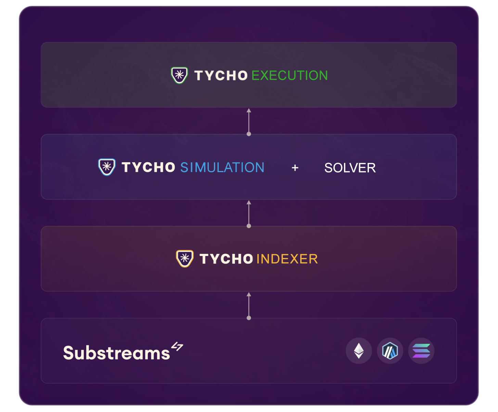

# About

<figure><figcaption></figcaption></figure>

## What is Tycho?

Tycho is an open-source interface to on-chain liquidity. Tycho

* **Indexes** DEX protocol state for you with low latency,
* **Simulates** swaps extremely fast with one interface for all DEXs, and &#x20;
* **Executes** swaps on-chain

## Ending the integration nightmare

<figure><figcaption></figcaption></figure>

Integrations are the largest point of friction for both DEXs and Solvers:

* **Solvers** can't scale integrations. So, Solvers spend much of their time on integrations, and new solvers can't catch up and compete.
* **DEXs** need to convince solvers to integrate them to get orderflow and win LPs. But Solvers prioritize DEXs with liquidity. This makes it hard for new DEXs to get the flow their design deserves.

In the end, every solver separately integrates every DEX – leading to massive wasted effort from which no one benefits.

Tycho fixes this:

* DEXs can integrate themselves and don't need to wait for solvers, and
* Solvers can use new DEXs without any additional effort.

Tycho lowers barriers to entry so that both innovative DEXs and Solvers have a chance to win flow.

## Get started

### Solvers – Access more liquidity

Tycho makes it easy to simulate and execute over on-chain liquidity sources – without needing to understand protocol internals, run nodes, or do RPC calls.

To set up, go to the [Tycho Indexer quickstart](../docs/for-solvers/indexer/) and start your liquidity stream.

### DEXs – Get more flow

To integrate your DEX, submit a PR to Tycho Protocol Integrations on [GitHub](https://github.com/propeller-heads/tycho-protocol-sdk).

To get started, check the [Protocol SDK ](../docs/for-dexs/protocol-integration/)docs.

Or [contact our team](https://t.me/jaintanay_) so we can help you integrate.

## Components of Tycho

<figure><figcaption></figcaption></figure>

Tycho has three components for solvers:

* **Tycho Indexer**: Infrastructure to parse, store and stream protocol state deltas. It also comes with clients in Python and Rust and a hosted webstream if you don't want to run your version of the Indexer. ->  [Indexer docs](../docs/for-solvers/indexer/).
* **Tycho Protocol Simulation:** A simulation library with a unified interface to query swaps and price&#x73;**.** Optimized for speed, running on compiled contracts in REVM with in-memory storage. -> [Protocol Simulation docs](../docs/for-solvers/simulation.md).
* **Tycho Execution:** Audited and gas-efficient router and DEX executor contracts for safe, simple, and competitive execution of swaps.

And one integration SDK for DEXs:

* **Tycho Protocol Integration:** An SDK for any DEX (or Stable Coin, LRT, etc.) to integrate their liquidity and receive flow from solvers.&#x20;

## FAQ

<strong>How does Tycho compare to just parsing logs myself?</strong>

While you can parse logs directly, Tycho provides parsed, and structured data, offers a unified interface across protocols, manages reorgs automatically, can handle protocols that don't emit logs and saves you the infrastructure cost of running a node.

<strong>Does this add gas to my swaps?</strong>

No it does not. Tycho contracts make it easy to simulate a DEX correctly for your swaps. But you can still execute the swaps directly with the DEX – as gas efficient as possible.

<strong>How do you handle reorgs?</strong>

Reorgs are handled automatically through our delta system. The client maintains the correct state without you having to worry about block reorganizations.

<strong>How does latency compare to other solutions?</strong>

Tycho processes updates in under 100ms (plus network latency). While an additional hop compared to running your own nodes, geographically distributed nodes race to provide data, which can be faster than relying on a single node.

<strong>Can I still use my own UniV2/V3 implementations?</strong>

Yes! Many teams use Tycho VM for newer/complex protocols while keeping their analytical implementations for simpler pools.

<strong>What about UniV4 hooks?</strong>

We aim to support as many hooks variants as possible through our VM implementation.

<strong>What's the difference between Native and VM implementations?</strong>

Native implementations provide protocol-specific state variables directly, letting you implement your own math and optimizations. VM implementations provide a unified interface through REVM, making integration easier but with less low-level control. Choose based on your needs. Native for maximum control, VM for easier integration.

<strong>How reliable is the state data?</strong>

The system handles reorgs automatically, keeps track of TVL changes, and maintains consistency across state updates. The data is synced against on-chain state and continuously validated.

